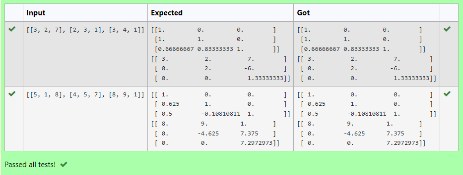

# LU Decomposition 

## AIM:
To write a program to find the LU Decomposition of a matrix.

## Equipments Required:
1. Hardware – PCs
2. Anaconda – Python 3.7 Installation / Moodle-Code Runner

## Algorithm
### Step 1:
Import numpy library using import statement.
### Step 2:
From scipy package import lu().
### Step 3:
Get input from user and pass it as an array.
### Step 4:
Get P, L, U matrix using lu()
### Step 5:
Print L and U matrix
 
 ## Program:
```python
#Program to find L and U matrix using LU decomposition.
#Developed by: Yogeshvar.M
#RegisterNumber: 22003358

import numpy as np
from scipy.linalg import lu
A = np.array(eval(input()))
P, L, U = lu(A)
print(L)
print(U)
```

## Output:



## Result:
Thus the program to find the LU Decomposition of a matrix is written and verified using python programming.

